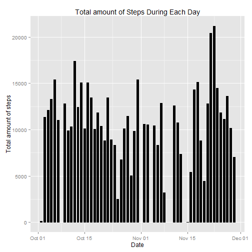
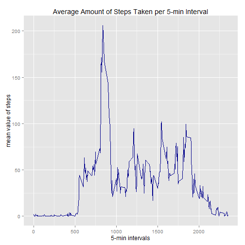
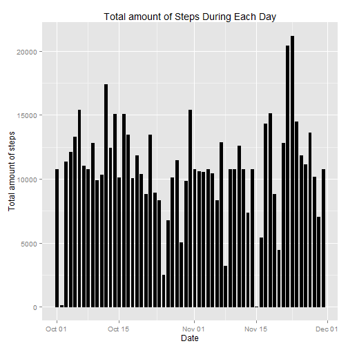
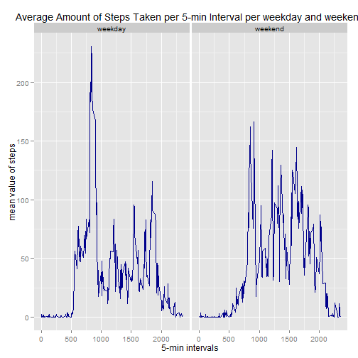

Global Setting to show all code chunks


```r
echo = TRUE
```
## Loading and preprocessing the data

Now it is necessary to load and slighly adjuts the data for further analysis, I have decided to remove NA's right away

```r
setwd("D:/DataScience/ReproducibleResearch/Project1/RepData_PeerAssessment1")
# i have downloaded it manually via link provided on coursera site
unzip("activity.zip")
activity  <- read.csv("activity.csv", colClasses = c("integer", "Date", "factor"))

library(lubridate)
activity$month  <- month(activity$date)#usable if one wants to further divide the plots based on which month the steps were taken
activityNA  <- na.omit(activity)
rownames(activityNA)  <- 1:15264
activityNA$month  <- as.factor(activityNA$month)
```

## What is mean total number of steps taken per day?
1. Make a histogram of the total number of steps taken each day


```r
library(ggplot2)
ggplot(activityNA, aes(date, steps)) + geom_bar(stat = "identity", col = "black", fill = "black", width = 0.6)  + labs(title = "Total amount of Steps During Each Day", x = "Date", y = "Total amount of steps")
```

 

2. Calculate and report the mean and median total number of steps taken per day


```r
StepsPerDay <- aggregate(activityNA$steps, list(Day = activityNA$date), FUN = "sum")
round(mean(StepsPerDay$x),0)
```

```
## [1] 10766
```

```r
median(StepsPerDay$x)
```

```
## [1] 10765
```
## What is the average daily activity pattern?
3. Make a time series plot (i.e. type = "l") of the 5-minute interval (x-axis) and the average number of steps taken, averaged across all days (y-axis)

```r
DailyPattern <- aggregate(activityNA$steps, list(interval = as.numeric(as.character(activityNA$interval))), FUN = "mean")
colnames(DailyPattern)  <- c("interval", "stepsMEAN")

ggplot(DailyPattern, aes(interval, stepsMEAN)) + geom_line(color = "darkblue", size = 0.7) + labs(title = "Average Amount of Steps Taken per 5-min Interval", x = "5-min intervals", y = "mean value of steps")
```

 

4. Which 5-minute interval, on average across all the days in the dataset, contains the maximum number of steps?


```r
DailyPattern[which.max(DailyPattern$stepsMEAN),]
```

```
##     interval stepsMEAN
## 104      835  206.1698
```

## Imputing missing values
5. The total number of rows with NAs:
here I obviously used the dataset in original form where I have not removed NA's


```r
sum(is.na(activity))
```

```
## [1] 2304
```

6. Devise a strategy for filling in all of the missing values in the dataset. The strategy does not need to be sophisticated. For example, you could use the mean/median for that day, or the mean for that 5-minute interval, etc.


```r
# I have decided to use previously calculated mean for each of the 5min interval
activityNAFIX <- activity 
for (i in 1:nrow(activityNAFIX)) {
    if (is.na(activityNAFIX$steps[i])) {
        activityNAFIX$steps[i] <- DailyPattern[which(activityNAFIX$interval[i] == DailyPattern$interval), ]$stepsMEAN
    }
}
```

7. Make a histogram of the total number of steps taken each day and Calculate and report the mean and median total number of steps taken per day


```r
ggplot(activityNAFIX, aes(date, steps)) + geom_bar(stat = "identity", col = "black", fill = "black", width = 0.6)  + labs(title = "Total amount of Steps During Each Day", x = "Date", y = "Total amount of steps")
```

 


```r
StepsPerDayNAFIX <- aggregate(activityNAFIX$steps, list(Day = activityNAFIX$date), FUN = "sum")
round(mean(StepsPerDayNAFIX$x),0)
```

```
## [1] 10766
```


```r
median(StepsPerDayNAFIX$x)
```

```
## [1] 10766.19
```

mean has not been changed (quite obvious since I have amputed the mean values for each day), median has increased little bit but still just a marginal change

## Are there differences in activity patterns between weekdays and weekends?

8. Create a new factor variable in the dataset with two levels -- "weekday" and "weekend" indicating whether a given date is a weekday or weekend day


```r
library(lubridate)
activityNAFIX$day  <- wday(activityNAFIX$date, label = TRUE)

levels(activityNAFIX$day)  <- list(weekday = c("Mon", "Tues", "Wed", "Thurs", "Fri"), weekend = c("Sat", "Sun"))

table(activityNAFIX$day)
```

```
## 
## weekday weekend 
##   12960    4608
```

9. Make a panel plot containing a time series plot (i.e. type = "l") of the 5-minute interval (x-axis) and the average number of steps taken, averaged across all weekday days or weekend days (y-axis).


```r
DailyPatternNAFIX <- aggregate(activityNAFIX$steps, list(interval = as.numeric(as.character(activityNAFIX$interval)), day = activityNAFIX$day), FUN = "mean")
colnames(DailyPatternNAFIX)  <- c("interval", "day", "stepsMEAN")

ggplot(DailyPatternNAFIX, aes(interval, stepsMEAN)) + geom_line(color = "darkblue", size = 0.7) + facet_grid(. ~ day)+labs(title = "Average Amount of Steps Taken per 5-min Interval per weekday and weekend", x = "5-min intervals", y = "mean value of steps")
```

 

```r
# to create html and md files use knit2html("PA1_template.Rmd"), make sure you have the rmd file in your working directory getwd(), setwd()
```

